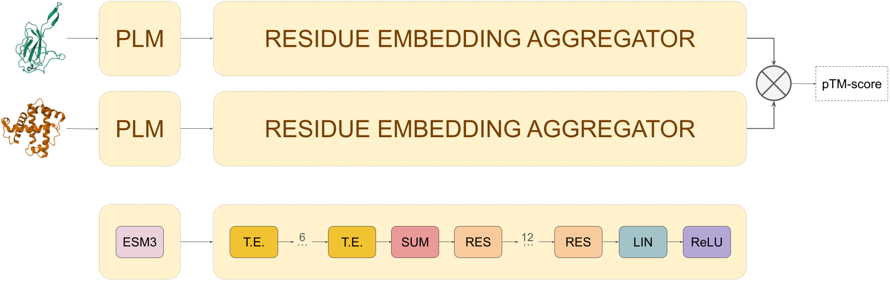

# RCSB Embedding Model

**Version** 0.0.48

## Overview

RCSB Embedding Model is a neural network architecture designed to encode macromolecular 3D structures into fixed-length vector embeddings for efficient large-scale structure similarity search.

Preprint: [Multi-scale structural similarity embedding search across entire proteomes](https://www.biorxiv.org/content/10.1101/2025.02.28.640875v1).

A web-based implementation using this model for structure similarity search is available at [rcsb-embedding-search](http://embedding-search.rcsb.org).

If you are interested in training the model with a new dataset, visit the [rcsb-embedding-search repository](https://github.com/bioinsilico/rcsb-embedding-search), which provides scripts and documentation for training.

## Features

- **Residue-level embeddings** computed using the ESM3 protein language model  
- **Structure-level embeddings** aggregated via a transformer-based aggregator network  
- **Command-line interface** implemented with Typer for high-throughput inference workflows  
- **Python API** for interactive embedding computation and integration into analysis pipelines  
- **High-performance inference** leveraging PyTorch Lightning, with multi-node and multi-GPU support  

---

## Installation

    pip install rcsb-embedding-model

**Requirements:**

- Python ≥ 3.10
- ESM >= 3.2.0
- Lightning ≥ 2.5.0 
- Typer ≥ 0.15.0

---

## Quick Start

### CLI

    # 1. Compute residue embeddings: Calculate residue level embeddings of protein structures using ESM3. Predictions are stored as torch tensor files.
    inference residue-embedding --src-file data/structures.csv --output-path results/residue_embeddings --structure-format mmcif --batch-size 8 --devices auto

    # 2. Compute structure embeddings: Calculate single-chain protein embeddings from structural files. Predictions are stored in a single pandas DataFrame file.
    inference structure-embedding --src-file data/structures.csv --output-path results/residue_embeddings --out-df-name df-res-embeddings --batch-size 4 --devices 0 --devives 1

    # 3. Compute chain embeddings: Calculate single-chain protein embeddings from residue level embeddings stored as torch tensor files. Predictions a re stored as csv files.
    inference chain-embedding --src-file data/structures.csv --output-path results/chain_embeddings --batch-size 4

    # 4. Compute assembly embeddings: Calculate assembly embeddings from residue level embeddings stored as torch tensor files. Predictions are stored as csv files.
    inference assembly-embedding --src-file data/structures.csv --res-embedding-location results/residue_embeddings --output-path results/assembly_embeddings

### Python API

    from rcsb_embedding_model import RcsbStructureEmbedding

    model = RcsbStructureEmbedding()

    # Compute per-residue embeddings
    res_emb = model.residue_embedding(
        src_structure="examples/1abc.cif",
        src_format="mmcif",
        chain_id="A"
    )

    # Aggregate to structure-level embedding
    struct_emb = model.aggregator_embedding(res_emb)

See the examples and tests directories for more use cases.

---

## Model Architecture

The embedding model is trained to predict structural similarity by approximating TM-scores using cosine distances between embeddings. It consists of two main components:

- **Protein Language Model (PLM)**: Computes residue-level embeddings from a given 3D structure.
- **Residue Embedding Aggregator**: A transformer-based neural network that aggregates these residue-level embeddings into a single vector.

### **Protein Language Model (PLM)**
Residue-wise embeddings of protein structures are computed using the [ESM3](https://www.evolutionaryscale.ai/) generative protein language model.

### **Residue Embedding Aggregator**
The aggregation component consists of six transformer encoder layers, each with a 3,072-neuron feedforward layer and ReLU activations. After processing through these layers, a summation pooling operation is applied, followed by 12 fully connected residual layers that refine the embeddings into a single 1,536-dimensional vector.

---

## Development

    git clone https://github.com/rcsb/rcsb-embedding-model.git
    cd rcsb-embedding-model
    pip install -e .
    pytest

---

## Citation

Segura, J., Bittrich, S., et al. (2024). *Multi-scale structural similarity embedding search across entire proteomes*. bioRxiv. (Preprint: https://www.biorxiv.org/content/10.1101/2025.02.28.640875v1)

---

## License

This project uses the EvolutionaryScale ESM-3 model and is distributed under the
[Cambrian Non-Commercial License Agreement](https://www.evolutionaryscale.ai/policies/cambrian-non-commercial-license-agreement).