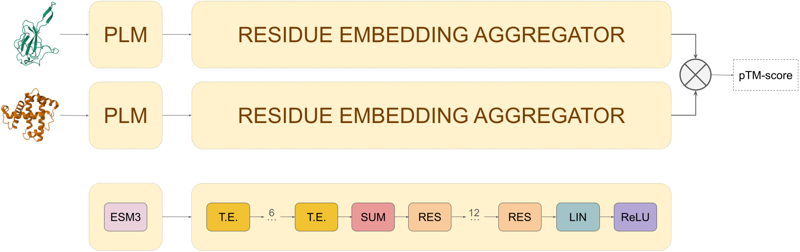

# FoldMatch

**Version** 0.3.0


## Overview

FoldMatch is a Python toolkit to encode macromolecular 3D structures into fixed-length vector embeddings for efficient large-scale structure similarity search and clustering.

Reference: [Multi-scale structural similarity embedding search across entire proteomes](https://doi.org/10.1093/bioinformatics/btag058).

A web-based implementation using this tool for structure similarity search is available at [rcsb-embedding-search](http://embedding-search.rcsb.org).

If you are interested in training a new model with a new structure dataset, visit the [rcsb-embedding-search repository](https://github.com/bioinsilico/rcsb-embedding-search), which provides scripts and documentation for training.


## Features

- **Residue-level embeddings** computed using the ESM3 protein language model
- **Sequence-based embeddings** from FASTA files without requiring 3D structures
- **Structure-level embeddings** aggregated via a transformer-based aggregator network 
- **Fast and efficient** FAISS-based similarity search
- **Structural clustering** using the Leiden algorithm for biological assembly identification
- **Command-line interface** implemented with Typer for high-throughput inference workflows  
- **Python API** for interactive embedding computation and integration into analysis pipelines  
- **High-performance inference** leveraging PyTorch Lightning, with multi-node and multi-GPU support  

---

## Installation

### From PyPI

```bash
pip install foldmatch
```

### From Source (Development)

```bash
git clone https://github.com/rcsb/foldmatch.git
cd foldmatch
pip install -e .
```

**Requirements:**

- Python ≥ 3.12
- ESM 3.2.3
- Lightning 2.6.1
- Typer 0.24.1
- Biotite 1.6.0
- FAISS 1.13.2
- igraph 1.0.0
- leidenalg 0.11.0
- PyTorch with CUDA support (recommended for GPU acceleration)

**Optional Dependencies:**

- `faiss-gpu` for GPU-accelerated similarity search (instead of `faiss-cpu`)

## Usage

The package provides two main interfaces:
1. **Command-line Interface (CLI)** for batch processing and high-throughput workflows
2. **Python API** for interactive use and integration into custom pipelines

---

## Command-Line Interface (CLI)

The CLI provides three main command groups: `fm-structure` for computing embeddings from a folder of structure files, `fm-sequence` for computing embeddings from protein sequences in FASTA files, and `fm-search` for building, updating, and querying FAISS databases for similarity search.

### Embedding Commands

#### `fm-structure residue`

Calculate residue-level embeddings using ESM3 from a folder of structure files. All chains in each structure are processed. Outputs are stored as PyTorch tensor files (default) or CSV files.

```bash
fm-structure residue \
  --src-folder data/structures \
  --output-path results/residue_embeddings \
  --structure-format mmcif \
  --batch-size 8 \
  --devices auto
```

**Key Options:**
- `--src-folder`: Folder containing structure files (`.cif`, `.pdb`, or `.bcif`, including `.gz` variants)
- `--output-path`: Directory to store embedding files
- `--output-format`: `separated` (individual files) or `grouped` (single JSON)
- `--output-name`: Filename when using `grouped` format (default: `inference`)
- `--write-csv` / `--no-write-csv`: Write embeddings as CSV files instead of tensor files when using `separated` format (default: disabled)
- `--structure-format`: `mmcif`, `binarycif`, or `pdb`
- `--min-res-n`: Minimum residue count for chain filtering (default: 0)
- `--batch-size`: Batch size for processing (default: 1)
- `--num-workers`: Data loader workers (default: 0)
- `--num-nodes`: Number of nodes for distributed inference (default: 1)
- `--accelerator`: Device type - `auto`, `cpu`, `cuda`, `gpu` (default: `auto`)
- `--devices`: Device indices (can specify multiple with `--devices 0 --devices 1`) or `auto`
- `--strategy`: Lightning distribution strategy (default: `auto`)

---

#### `fm-structure chain`

Compute chain-level embeddings from a folder of structure files. By default, residue embeddings are computed as a first step and stored in `--res-embedding-location`, then aggregated into chain embeddings. Use `--no-compute-residue-embedding` to skip the residue step and use pre-computed residue embeddings.

```bash
# End-to-end: compute residue + chain embeddings
fm-structure chain \
  --src-folder data/structures \
  --res-embedding-location results/residue_embeddings \
  --output-path results/chain_embeddings \
  --batch-size 4

# Using pre-computed residue embeddings
fm-structure chain \
  --src-folder data/structures \
  --res-embedding-location results/residue_embeddings \
  --output-path results/chain_embeddings \
  --no-compute-residue-embedding \
  --batch-size 4
```

**Key Options:**
- `--src-folder`: Folder containing structure files
- `--res-embedding-location`: Directory for residue embedding tensor files (output when computing, input for chain aggregation)
- `--output-path`: Directory to store chain embedding CSV files
- `--compute-residue-embedding` / `--no-compute-residue-embedding`: Compute residue embeddings first (default: enabled)
- `--output-format`: `separated` (individual files) or `grouped` (single JSON)
- `--output-name`: Filename when using `grouped` format (default: `inference`)
- All other options similar to `fm-structure residue`

---

#### `fm-structure assembly`

Compute assembly-level embeddings from a folder of structure files. By default, residue embeddings are computed as a first step and stored in `--res-embedding-location`, then aggregated into assembly embeddings. Use `--no-compute-residue-embedding` to skip the residue step and use pre-computed residue embeddings.

```bash
# End-to-end: compute residue + assembly embeddings
fm-structure assembly \
  --src-folder data/structures \
  --res-embedding-location results/residue_embeddings \
  --output-path results/assembly_embeddings \
  --min-res-n 10 \
  --max-res-n 10000

# Using pre-computed residue embeddings
fm-structure assembly \
  --src-folder data/structures \
  --res-embedding-location results/residue_embeddings \
  --output-path results/assembly_embeddings \
  --no-compute-residue-embedding \
  --min-res-n 10 \
  --max-res-n 10000
```

**Key Options:**
- `--src-folder`: Folder containing structure files
- `--res-embedding-location`: Directory for residue embedding tensor files (output when computing, input for assembly aggregation)
- `--output-path`: Directory to store assembly embedding CSV files
- `--compute-residue-embedding` / `--no-compute-residue-embedding`: Compute residue embeddings first (default: enabled)
- `--output-format`: `separated` (individual files) or `grouped` (single JSON)
- `--output-name`: Filename when using `grouped` format (default: `inference`)
- `--min-res-n`: Minimum residues per chain (default: 0)
- `--max-res-n`: Maximum total residues for assembly (default: unlimited)
- All other options similar to `fm-structure residue`

---

#### `fm-structure download-models`

Download ESM3 and aggregator models from Hugging Face.

```bash
fm-structure download-models
```

---

### Sequence Commands

#### `fm-sequence residue`

Calculate residue-level ESM embeddings from protein sequences in a FASTA file. No 3D structure information is required. Outputs are stored as PyTorch tensor files (default) or CSV files.

```bash
fm-sequence residue \
  --fasta-file sequences.fasta \
  --output-path results/residue_embeddings \
  --batch-size 8 \
  --devices auto
```

**Key Options:**
- `--fasta-file`: FASTA file containing protein sequences
- `--output-path`: Directory to store embedding files
- `--output-format`: `separated` (individual files) or `grouped` (single JSON)
- `--output-name`: Filename when using `grouped` format (default: `inference`)
- `--write-csv` / `--no-write-csv`: Write embeddings as CSV files instead of tensor files when using `separated` format (default: disabled)
- `--min-res-n`: Minimum residue count for sequence filtering (default: 0)
- `--batch-size`: Batch size for processing (default: 1)
- `--num-workers`: Data loader workers (default: 0)
- `--num-nodes`: Number of nodes for distributed inference (default: 1)
- `--accelerator`: Device type - `auto`, `cpu`, `cuda`, `gpu` (default: `auto`)
- `--devices`: Device indices (can specify multiple with `--devices 0 --devices 1`) or `auto`
- `--strategy`: Lightning distribution strategy (default: `auto`)

---

#### `fm-sequence chain`

Compute chain-level embeddings from protein sequences in a FASTA file. By default, residue embeddings are computed as a first step and stored in `--res-embedding-location`, then aggregated into chain embeddings using the transformer-based aggregator. Use `--no-compute-residue-embedding` to skip the residue step and use pre-computed residue embeddings.

```bash
# End-to-end: compute residue + chain embeddings
fm-sequence chain \
  --fasta-file sequences.fasta \
  --res-embedding-location results/residue_embeddings \
  --output-path results/chain_embeddings \
  --batch-size 4

# Using pre-computed residue embeddings
fm-sequence chain \
  --fasta-file sequences.fasta \
  --res-embedding-location results/residue_embeddings \
  --output-path results/chain_embeddings \
  --no-compute-residue-embedding \
  --batch-size 4
```

**Key Options:**
- `--fasta-file`: FASTA file containing protein sequences
- `--res-embedding-location`: Directory for residue embedding tensor files (output when computing, input for chain aggregation)
- `--output-path`: Directory to store chain embedding CSV files
- `--compute-residue-embedding` / `--no-compute-residue-embedding`: Compute residue embeddings first (default: enabled)
- `--output-format`: `separated` (individual files) or `grouped` (single JSON)
- `--output-name`: Filename when using `grouped` format (default: `inference`)
- All other options similar to `fm-sequence residue-embedding`

---

#### `fm-sequence download-models`

Download ESM3 and aggregator models from Hugging Face.

```bash
fm-sequence download-models
```

---

### Search Commands

#### `fm-search build structures`

Build a FAISS database from structure files for similarity search. Residue embeddings are computed first using ESM3, then aggregated into chain or assembly embeddings.

```bash
fm-search build structures \
  --structure-dir data/pdb_files \
  --output databases/my_structures \
  --tmp-dir tmp \
  --granularity chain \
  --min-res 10 \
  --use-gpu-index
```

**Key Options:**
- `--structure-dir`: Directory containing structure files
- `--output-db`: Database path (prefix for `.index` and `.metadata` files)
- `--tmp-dir`: Temporary directory for intermediate files
- `--structure-format`: `mmcif`, `binarycif`, or `pdb`
- `--granularity`: `chain` or `assembly` level embeddings
- `--file-extension`: Filter files by extension (e.g., `.cif`, `.bcif`, `.pdb`)
- `--min-res`: Minimum residue count (default: 10)
- `--use-gpu-index`: Use GPU for FAISS index construction
- `--accelerator`, `--devices`, `--strategy`: Inference device settings
- `--batch-size-res`, `--num-workers-res`, `--num-nodes-res`: Residue embedding settings
- `--batch-size-aggregator`, `--num-workers-aggregator`, `--num-nodes-aggregator`: Aggregator settings

---

#### `fm-search update structures`

Update an existing FAISS database with new or replacement structure files. Structures with IDs already present in the database are replaced; new IDs are added. The FAISS index is fully rebuilt after merging.

```bash
fm-search update structures \
  --structure-dir data/new_structures \
  --output-db databases/my_structures \
  --tmp-dir tmp \
  --structure-format mmcif \
  --granularity chain \
  --min-res 10 \
  --batch-size-res 8
```

**Key Options:**
- `--structure-dir`: Directory containing new or updated structure files
- `--output-db`: Path to the existing FAISS database to update
- `--tmp-dir`: Temporary directory for intermediate files
- `--structure-format`: `mmcif`, `binarycif`, or `pdb`
- `--granularity`: `chain` or `assembly` level embeddings
- `--file-extension`: Filter files by extension (e.g., `.cif`, `.bcif`, `.pdb`)
- `--min-res`: Minimum residue count (default: 10)
- `--use-gpu-index`: Use GPU for FAISS index construction
- `--accelerator`, `--devices`, `--strategy`: Inference device settings
- `--batch-size-res`, `--num-workers-res`, `--num-nodes-res`: Residue embedding settings
- `--batch-size-aggregator`, `--num-workers-aggregator`, `--num-nodes-aggregator`: Aggregator settings
- `--log-level`: Logging level - `info`, `warn`, or `debug` (default: `info`)

---

#### `fm-search build embeddings`

Build a FAISS database from a directory of pre-computed embedding files (`.csv` or `.pt`). The filename without extension is used as the embedding ID in the database. This is useful when embeddings have been previously computed with any of the `fm-structure` or `fm-sequence` commands.

```bash
fm-search build embeddings \
  --embedding-dir results/chain_embeddings \
  --output-db databases/my_structures \
  --file-extension .pt
```

**Key Options:**
- `--embedding-dir`: Directory containing pre-computed embedding files (`.csv` or `.pt`)
- `--output-db`: Database path (prefix for `.index` and `.metadata` files)
- `--file-extension`: Filter by extension (`.csv` or `.pt`). If not specified, collects both
- `--use-gpu-index`: Use GPU for FAISS index construction
- `--log-level`: Logging level (default: `info`)

---

#### `fm-search update embeddings`

Update an existing FAISS database with new or replacement embeddings from pre-computed files (`.csv` or `.pt`). Embeddings with IDs already present in the database are replaced; new IDs are added.

```bash
fm-search update embeddings \
  --embedding-dir results/new_embeddings \
  --output-db databases/my_structures \
  --file-extension .pt
```

**Key Options:**
- `--embedding-dir`: Directory containing pre-computed embedding files (`.csv` or `.pt`)
- `--output-db`: Path to the existing FAISS database to update
- `--file-extension`: Filter by extension (`.csv` or `.pt`). If not specified, collects both
- `--use-gpu-index`: Use GPU for FAISS index construction
- `--log-level`: Logging level (default: `info`)

---

#### `fm-search build sequneces`

Build a FAISS database from protein sequences in a FASTA file. Residue embeddings are computed first using ESM3, then aggregated into chain embeddings. The FASTA sequence names are used as embedding IDs.

```bash
fm-search build sequences \
  --fasta-file sequences.fasta \
  --output-db databases/my_sequences \
  --tmp-dir tmp \
  --batch-size 4
```

**Key Options:**
- `--fasta-file`: FASTA file containing protein sequences
- `--output-db`: Database path (prefix for `.index` and `.metadata` files)
- `--tmp-dir`: Directory for intermediate residue embeddings
- `--min-res-n`: Minimum residue count for sequence filtering (default: 0)
- `--compute-residue-embedding` / `--no-compute-residue-embedding`: Compute residue embeddings first (default: enabled). Disable to use pre-computed residue embeddings in `--tmp-dir`
- `--use-gpu-index`: Use GPU for FAISS index construction
- `--accelerator`, `--devices`, `--strategy`: Inference device settings
- `--batch-size`, `--num-workers`, `--num-nodes`: Residue embedding inference settings
- `--batch-size-aggregator`, `--num-workers-aggregator`, `--num-nodes-aggregator`: Chain embedding inference settings
- `--log-level`: Logging level (default: `info`)

---

#### `fm-search update sequences`

Update an existing FAISS database with new or replacement embeddings computed from protein sequences in a FASTA file. Embeddings with IDs already present in the database are replaced; new IDs are added.

```bash
fm-search update sequences \
  --fasta-file new_sequences.fasta \
  --output-db databases/my_sequences \
  --tmp-dir tmp \
  --batch-size 4
```

**Key Options:**
- `--fasta-file`: FASTA file containing protein sequences
- `--output-db`: Path to the existing FAISS database to update
- `--tmp-dir`: Directory for intermediate residue embeddings
- `--min-res-n`: Minimum residue count for sequence filtering (default: 0)
- `--compute-residue-embedding` / `--no-compute-residue-embedding`: Compute residue embeddings first (default: enabled). Disable to use pre-computed residue embeddings in `--tmp-dir`
- `--use-gpu-index`: Use GPU for FAISS index construction
- `--accelerator`, `--devices`, `--strategy`: Inference device settings
- `--batch-size`, `--num-workers`, `--num-nodes`: Residue embedding inference settings
- `--batch-size-aggregator`, `--num-workers-aggregator`, `--num-nodes-aggregator`: Chain embedding inference settings
- `--log-level`: Logging level (default: `info`)

---

#### `fm-search query structure`

Search the database for structures similar to a query structure.

```bash
fm-search query \
  --db-path databases/my_structures \
  --query-structure query.cif \
  --structure-format mmcif \
  --granularity chain \
  --top-k 100 \
  --threshold 0.8 \
  --output-csv results.csv
```

**Key Options:**
- `--db-path`: Path to FAISS database
- `--query-structure`: Query structure file
- `--structure-format`: `mmcif` or `pdb`
- `--granularity`: `chain` or `assembly` search mode
- `--chain-id`: Specific chain to search (optional)
- `--assembly-id`: Specific assembly ID (optional)
- `--top-k`: Number of results per query (default: 100)
- `--threshold`: Minimum similarity score (default: 0.8)
- `--output-csv`: Export results to CSV (optional)
- `--min-res`: Minimum residue filter (default: 10)
- `--max-res`: Maximum residue filter (optional)
- `--device`: `cuda`, `cpu`, or `auto`
- `--use-gpu-index`: Use GPU for FAISS search

---

#### `fm-search query embedding`

Search the database using a single pre-computed embedding file (`.csv` or `.pt`). The filename stem is used as the query ID. No model inference is required — the embedding is loaded directly and queried against the FAISS index.

```bash
fm-search query-from-embedding \
  --db-path databases/my_structures \
  --embedding-file results/chain_embeddings/1acb.A.pt \
  --top-k 100 \
  --threshold 0.8 \
  --output-csv results.csv
```

**Key Options:**
- `--db-path`: Path to FAISS database
- `--embedding-file`: Pre-computed embedding file (`.csv` or `.pt`). The filename stem is used as the query ID
- `--top-k`: Number of results to return (default: 100)
- `--threshold`: Minimum similarity score (default: 0.8)
- `--output-csv`: Export results to CSV (optional)
- `--use-gpu-index`: Use GPU for FAISS search
- `--log-level`: Logging level (default: `info`)

---

#### `fm-search query sequences`

Search the database using protein sequences from a FASTA file. Each sequence is used as a separate query, producing its own ranked result list. Residue and chain embeddings are computed first using ESM3, then each sequence is searched against the database.

```bash
fm-search query-from-fasta \
  --db-path databases/my_structures \
  --fasta-file queries.fasta \
  --tmp-dir tmp \
  --top-k 100 \
  --threshold 0.8 \
  --output-csv results.csv
```

**Key Options:**
- `--db-path`: Path to FAISS database
- `--fasta-file`: FASTA file with protein sequences (each sequence is queried independently)
- `--tmp-dir`: Directory for intermediate residue embeddings
- `--min-res-n`: Minimum residue count for sequence filtering (default: 0)
- `--compute-residue-embedding` / `--no-compute-residue-embedding`: Compute residue embeddings first (default: enabled). Disable to use pre-computed residue embeddings in `--tmp-dir`
- `--top-k`: Number of results per query sequence (default: 100)
- `--threshold`: Minimum similarity score (default: 0.8)
- `--output-csv`: Export results to CSV (optional)
- `--use-gpu-index`: Use GPU for FAISS search
- `--accelerator`, `--devices`, `--strategy`: Inference device settings
- `--batch-size`, `--num-workers`, `--num-nodes`: Residue embedding inference settings
- `--batch-size-aggregator`, `--num-workers-aggregator`, `--num-nodes-aggregator`: Chain embedding inference settings
- `--log-level`: Logging level (default: `info`)

---

#### `fm-search query db`

Compare all entries from a query database against a subject database.

```bash
fm-search query \
  --query-db-path databases/query_set \
  --subject-db-path databases/target_set \
  --top-k 100 \
  --threshold 0.8 \
  --output-csv comparisons.csv
```

**Key Options:**
- `--query-db-path`: Query database path
- `--subject-db-path`: Subject database to search
- `--top-k`: Results per query (default: 100)
- `--threshold`: Similarity threshold (default: 0.8)
- `--output-csv`: Export results to CSV
- `--use-gpu-index`: Use GPU acceleration

---

#### `fm-search stats`

Display database statistics.

```bash
fm-search stats --db-path databases/my_structures
```

---

#### `fm-search cluster`

Cluster database embeddings using the Leiden algorithm.

```bash
fm-search cluster \
  --db-path databases/my_structures \
  --threshold 0.8 \
  --resolution 1.0 \
  --output clusters.csv \
  --max-neighbors 1000 \
  --min-cluster-size 5
```

**Key Options:**
- `--db-path`: Database path
- `--threshold`: Similarity threshold for edge creation (default: 0.8)
- `--resolution`: Leiden resolution parameter - higher values create more clusters (default: 1.0)
- `--output`: Output file (`.csv` or `.json`)
- `--max-neighbors`: Maximum neighbors per chain (default: 1000)
- `--min-cluster-size`: Filter out smaller clusters (optional)
- `--use-gpu-index`: Use GPU for FAISS operations
- `--seed`: Random seed for reproducibility (optional)

---

#### `fm-search similarity-graph`

Build a similarity graph from database embeddings and export it in [GraphML](http://graphml.graphdrawing.org/) format. Each node represents a chain (identified by its chain ID) and each edge carries a `weight` attribute with the cosine similarity score between the two connected chains.

```bash
fm-search similarity-graph \
  --db-path databases/my_structures \
  --threshold 0.8 \
  --output similarity_graph.graphml \
  --max-neighbors 1000
```

**Key Options:**
- `--db-path`: Database path
- `--threshold`: Minimum similarity score to create an edge (default: 0.8)
- `--output`: Output GraphML file (default: `similarity_graph.graphml`)
- `--max-neighbors`: Maximum neighbors per chain considered during k-NN search (default: 1000)
- `--use-gpu-index`: Use GPU for FAISS operations
- `--log-level`: Logging verbosity level (default: `info`)

The resulting GraphML file can be loaded directly into tools such as [Gephi](https://gephi.org/), [Cytoscape](https://cytoscape.org/), or Python's [NetworkX](https://networkx.org/):

```python
import networkx as nx
G = nx.read_graphml("similarity_graph.graphml")
```

---

## Python API

The `RcsbStructureEmbedding` class provides methods for computing embeddings programmatically.

### Basic Usage

```python
from foldmatch import FoldMatch

# Initialize model
model = FoldMatch(min_res=10, max_res=5000)

# Load models (optional - loads automatically on first use)
model.load_models()  # Auto-detects CUDA
# or specify device:
# import torch
# model.load_models(device=torch.device("cuda:0"))
```

### Methods

#### `load_models(device=None)`

Load both residue and aggregator models.

```python
import torch
model.load_models(device=torch.device("cuda"))
```

---

#### `load_residue_embedding(device=None)`

Load only the ESM3 residue embedding model.

```python
model.load_residue_embedding()
```

---

#### `load_aggregator_embedding(device=None)`

Load only the aggregator model.

```python
model.load_aggregator_embedding()
```

---

#### `residue_embedding(src_structure, structure_format='mmcif', chain_id=None, assembly_id=None)`

Compute per-residue embeddings for a structure.

**Parameters:**
- `src_structure`: File path, URL, or file-like object
- `structure_format`: `'mmcif'`, `'binarycif'`, or `'pdb'`
- `chain_id`: Specific chain ID (optional, uses all chains if None)
- `assembly_id`: Assembly ID for biological assembly (optional)

**Returns:** `torch.Tensor` of shape `[num_residues, embedding_dim]`

```python
# Single chain
residue_emb = model.residue_embedding(
    src_structure="1abc.cif",
    structure_format="mmcif",
    chain_id="A"
)

# All chains concatenated
all_residues = model.residue_embedding(
    src_structure="1abc.cif",
    structure_format="mmcif"
)

# Biological assembly
assembly_residues = model.residue_embedding(
    src_structure="1abc.cif",
    structure_format="mmcif",
    assembly_id="1"
)
```

---

#### `residue_embedding_by_chain(src_structure, structure_format='mmcif', chain_id=None)`

Compute per-residue embeddings separately for each chain.

**Returns:** `dict[str, torch.Tensor]` mapping chain IDs to embeddings

```python
chain_embeddings = model.residue_embedding_by_chain(
    src_structure="1abc.cif",
    structure_format="mmcif"
)
# Returns: {'A': tensor(...), 'B': tensor(...), ...}

# Get specific chain
chain_a = model.residue_embedding_by_chain(
    src_structure="1abc.cif",
    chain_id="A"
)
```

---

#### `residue_embedding_by_assembly(src_structure, structure_format='mmcif', assembly_id=None)`

Compute residue embeddings for an assembly.

**Returns:** `dict[str, torch.Tensor]` mapping assembly ID to concatenated embeddings

```python
assembly_emb = model.residue_embedding_by_assembly(
    src_structure="1abc.cif",
    structure_format="mmcif",
    assembly_id="1"
)
# Returns: {'1': tensor(...)}
```

---

#### `sequence_embedding(sequence)`

Compute residue embeddings from amino acid sequence (no structural information).

**Parameters:**
- `sequence`: Amino acid sequence string (plain or FASTA format)

**Returns:** `torch.Tensor` of shape `[sequence_length, embedding_dim]`

```python
# Plain sequence
seq_emb = model.sequence_embedding("ACDEFGHIKLMNPQRSTVWY")

# FASTA format
fasta = """>Protein1
ACDEFGHIKLMNPQRSTVWY
ACDEFGHIKLMNPQRSTVWY"""
seq_emb = model.sequence_embedding(fasta)
```

---

#### `aggregator_embedding(residue_embedding)`

Aggregate residue embeddings into a single structure-level vector.

**Parameters:**
- `residue_embedding`: `torch.Tensor` from residue embedding methods

**Returns:** `torch.Tensor` of shape `[1536]`

```python
residue_emb = model.residue_embedding("1abc.cif", chain_id="A")
structure_emb = model.aggregator_embedding(residue_emb)
```

---

#### `structure_embedding(src_structure, structure_format='mmcif', chain_id=None, assembly_id=None)`

End-to-end: compute residue embeddings and aggregate in one call.

```python
# Complete structure embedding
structure_emb = model.structure_embedding(
    src_structure="1abc.cif",
    structure_format="mmcif",
    chain_id="A"
)
# Returns: tensor of shape [1536]
```

---

### Complete Example

```python
from foldmatch import FoldMatch
import torch

# Initialize
model = FoldMatch(min_res=10, max_res=5000)

# Option 1: Full structure embedding (one-shot)
embedding = model.structure_embedding(
    src_structure="1abc.cif",
    structure_format="mmcif",
    chain_id="A"
)

# Option 2: Step-by-step with residue embeddings
residue_emb = model.residue_embedding(
    src_structure="1abc.cif",
    structure_format="mmcif",
    chain_id="A"
)
structure_emb = model.aggregator_embedding(residue_emb)

# Option 3: Process multiple chains
chain_embeddings = model.residue_embedding_by_chain(
    src_structure="1abc.cif"
)
for chain_id, res_emb in chain_embeddings.items():
    chain_emb = model.aggregator_embedding(res_emb)
    print(f"Chain {chain_id}: {chain_emb.shape}")

# Sequence-based embedding
seq_emb = model.sequence_embedding("ACDEFGHIKLMNPQRSTVWY")
structure_from_seq = model.aggregator_embedding(seq_emb)
```

See the `examples/` and `tests/` directories for more use cases.

---

## Model Architecture

The embedding model is trained to predict structural similarity by approximating TM-scores using cosine distances between embeddings. It consists of two main components:

- **Protein Language Model (PLM)**: Computes residue-level embeddings from a given 3D structure.
- **Residue Embedding Aggregator**: A transformer-based neural network that aggregates these residue-level embeddings into a single vector.



### **Protein Language Model (PLM)**
Residue-wise embeddings of protein structures are computed using the [ESM3](https://www.evolutionaryscale.ai/) generative protein language model.

### **Residue Embedding Aggregator**
The aggregation component consists of six transformer encoder layers, each with a 3,072-neuron feedforward layer and ReLU activations. After processing through these layers, a summation pooling operation is applied, followed by 12 fully connected residual layers that refine the embeddings into a single 1,536-dimensional vector.

---

## Testing

After installation, run the test suite:

```bash
pytest
```

---

## Citation

Segura, J., et al. (2026). *Multi-scale structural similarity embedding search across entire proteomes*. (https://doi.org/10.1093/bioinformatics/btag058)

---

## License

This project uses the EvolutionaryScale ESM-3 model and is distributed under the
[Cambrian Non-Commercial License Agreement](https://www.evolutionaryscale.ai/policies/cambrian-non-commercial-license-agreement).