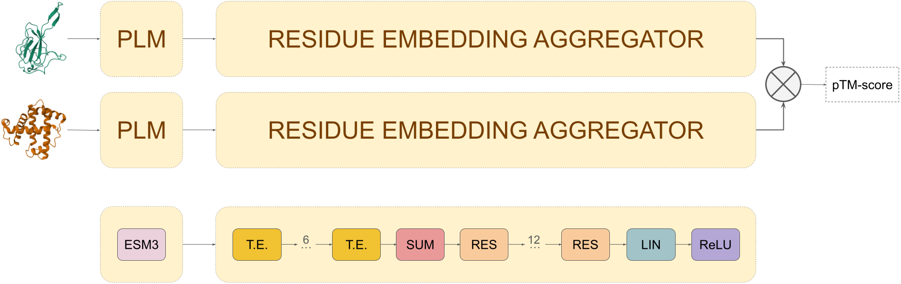

# FoldMatch

**Version** 0.6.0


## Overview

FoldMatch is a Python toolkit to encode macromolecular 3D structures into fixed-length vector embeddings for efficient large-scale structure similarity search and clustering.

Reference: [Multi-scale structural similarity embedding search across entire proteomes](https://doi.org/10.1093/bioinformatics/btag058).

A web-based implementation using this tool for structure similarity search is available at [rcsb-embedding-search](http://embedding-search.rcsb.org).

If you are interested in training a new model with a new structure dataset, visit the [rcsb-embedding-search repository](https://github.com/bioinsilico/rcsb-embedding-search), which provides scripts and documentation for training.


## Features

- **Residue-level embeddings** computed using the ESM3 protein language model
- **Sequence-based embeddings** from FASTA files without requiring 3D structures
- **Structure-level embeddings** aggregated via a transformer-based aggregator network 
- **Fast and efficient** FAISS-based similarity search
- **Structural clustering** using the Leiden algorithm for biological assembly identification
- **Command-line interface** implemented with Typer for high-throughput inference workflows  
- **Python API** for interactive embedding computation and integration into analysis pipelines  
- **High-performance inference** leveraging PyTorch Lightning, with multi-node and multi-GPU support  

---

## Installation

### From PyPI

```bash
pip install foldmatch
```

### From Source (Development)

```bash
git clone https://github.com/rcsb/foldmatch.git
cd foldmatch
pip install -e .
```

**Requirements:**

- Python ≥ 3.12
- ESM 3.2.3
- Lightning 2.6.1
- Typer 0.24.1
- Biotite 1.6.0
- FAISS 1.13.2
- igraph 1.0.0
- leidenalg 0.11.0
- PyTorch with CUDA support (recommended for GPU acceleration)

**Optional Dependencies:**

- `faiss-gpu` for GPU-accelerated similarity search (instead of `faiss-cpu`)


## Usage

The package provides two main interfaces:
1. **Command-line Interface (CLI)** for batch processing and high-throughput workflows
2. **Python API** for interactive use and integration into custom pipelines

---

## Command-Line Interface (CLI)

The toolkit ships three CLIs. Each is invoked with `--help` for full option documentation; the canonical examples below are enough to get started.

### `fm-embedding` — compute embeddings

Two subcommand groups reflect input modality:

```bash
# Residue / chain / assembly embeddings from a folder of 3D structures
fm-embedding from-structures residue  --src-folder data/pdb --output-path out --structure-format mmcif
fm-embedding from-structures chain    --src-folder data/pdb --output-path out --structure-format mmcif
fm-embedding from-structures assembly --src-folder data/pdb --output-path out --structure-format mmcif

# Residue / chain embeddings from protein sequences in a FASTA file (no 3D required)
fm-embedding from-sequences  residue  --fasta-file seqs.fasta --output-path out
fm-embedding from-sequences  chain    --fasta-file seqs.fasta --output-path out

# One-shot model download
fm-embedding download-models
```

Assembly-level embeddings are only available under `from-structures` — there is no assembly concept for a bare sequence.

Run `fm-embedding [from-structures|from-sequences] [command] --help` for full options (batch size, accelerator, devices, output format, distributed settings, etc.).

### `fm-search` — build and query FAISS databases

```bash
# Build a similarity-search database from structures, FASTA, or pre-computed embeddings
fm-search build structures  --structure-folder data/pdb --output-db dbs/my_db --tmp-embedding-folder tmp
fm-search build sequences   --fasta-file seqs.fasta     --output-db dbs/my_db --tmp-embedding-folder tmp
fm-search build embeddings  --embedding-folder out      --output-db dbs/my_db

# Query the database
fm-search query structure   --db-path dbs/my_db --query-structure q.cif
fm-search query sequences   --db-path dbs/my_db --fasta-file q.fasta --tmp-embedding-folder tmp
fm-search query embedding   --db-path dbs/my_db --embedding-file q.pt
fm-search query db          --query-db-path dbs/queries --subject-db-path dbs/my_db

# Inspect, cluster, export
fm-search stats             --db-path dbs/my_db
fm-search cluster           --db-path dbs/my_db --output clusters.csv
fm-search similarity-graph  --db-path dbs/my_db --output graph.graphml
```

All `build` commands accept `--index-type [auto|flat|hnsw|ivf_pq]` and IVF-PQ tuning flags (`--ivf-nlist`, `--ivf-nprobe`). See `fm-search <subcommand> --help` for the full surface.

### `inference` — low-level inference subcommands

Lower-level entry point exposing individual inference passes (`residue-embedding`, `structure-embedding`, `chain-embedding`, `assembly-embedding`, `complete-embedding`). Mostly useful for advanced workflows that compose inference stages explicitly. Run `inference --help` for the command list.

---

## Python API

The `RcsbStructureEmbedding` class provides methods for computing embeddings programmatically.

### Basic Usage

```python
from foldmatch import FoldMatch

# Initialize model
model = FoldMatch(min_res=10, max_res=5000)

# Load models (optional - loads automatically on first use)
model.load_models()  # Auto-detects CUDA
# or specify device:
# import torch
# model.load_models(device=torch.device("cuda:0"))
```

### Methods

#### `load_models(device=None)`

Load both residue and aggregator models.

```python
import torch
model.load_models(device=torch.device("cuda"))
```

---

#### `load_residue_embedding(device=None)`

Load only the ESM3 residue embedding model.

```python
model.load_residue_embedding()
```

---

#### `load_aggregator_embedding(device=None)`

Load only the aggregator model.

```python
model.load_aggregator_embedding()
```

---

#### `residue_embedding(src_structure, structure_format='mmcif', chain_id=None, assembly_id=None)`

Compute per-residue embeddings for a structure.

**Parameters:**
- `src_structure`: File path, URL, or file-like object
- `structure_format`: `'mmcif'`, `'binarycif'`, or `'pdb'`
- `chain_id`: Specific chain ID (optional, uses all chains if None)
- `assembly_id`: Assembly ID for biological assembly (optional)

**Returns:** `torch.Tensor` of shape `[num_residues, embedding_dim]`

```python
# Single chain
residue_emb = model.residue_embedding(
    src_structure="1abc.cif",
    structure_format="mmcif",
    chain_id="A"
)

# All chains concatenated
all_residues = model.residue_embedding(
    src_structure="1abc.cif",
    structure_format="mmcif"
)

# Biological assembly
assembly_residues = model.residue_embedding(
    src_structure="1abc.cif",
    structure_format="mmcif",
    assembly_id="1"
)
```

---

#### `residue_embedding_by_chain(src_structure, structure_format='mmcif', chain_id=None)`

Compute per-residue embeddings separately for each chain.

**Returns:** `dict[str, torch.Tensor]` mapping chain IDs to embeddings

```python
chain_embeddings = model.residue_embedding_by_chain(
    src_structure="1abc.cif",
    structure_format="mmcif"
)
# Returns: {'A': tensor(...), 'B': tensor(...), ...}

# Get specific chain
chain_a = model.residue_embedding_by_chain(
    src_structure="1abc.cif",
    chain_id="A"
)
```

---

#### `residue_embedding_by_assembly(src_structure, structure_format='mmcif', assembly_id=None)`

Compute residue embeddings for an assembly.

**Returns:** `dict[str, torch.Tensor]` mapping assembly ID to concatenated embeddings

```python
assembly_emb = model.residue_embedding_by_assembly(
    src_structure="1abc.cif",
    structure_format="mmcif",
    assembly_id="1"
)
# Returns: {'1': tensor(...)}
```

---

#### `sequence_embedding(sequence)`

Compute residue embeddings from amino acid sequence (no structural information).

**Parameters:**
- `sequence`: Amino acid sequence string (plain or FASTA format)

**Returns:** `torch.Tensor` of shape `[sequence_length, embedding_dim]`

```python
# Plain sequence
seq_emb = model.sequence_embedding("ACDEFGHIKLMNPQRSTVWY")

# FASTA format
fasta = """>Protein1
ACDEFGHIKLMNPQRSTVWY
ACDEFGHIKLMNPQRSTVWY"""
seq_emb = model.sequence_embedding(fasta)
```

---

#### `aggregator_embedding(residue_embedding)`

Aggregate residue embeddings into a single structure-level vector.

**Parameters:**
- `residue_embedding`: `torch.Tensor` from residue embedding methods

**Returns:** `torch.Tensor` of shape `[1536]`

```python
residue_emb = model.residue_embedding("1abc.cif", chain_id="A")
structure_emb = model.aggregator_embedding(residue_emb)
```

---

#### `structure_embedding(src_structure, structure_format='mmcif', chain_id=None, assembly_id=None)`

End-to-end: compute residue embeddings and aggregate in one call.

```python
# Complete structure embedding
structure_emb = model.structure_embedding(
    src_structure="1abc.cif",
    structure_format="mmcif",
    chain_id="A"
)
# Returns: tensor of shape [1536]
```

---

### Complete Example

```python
from foldmatch import FoldMatch
import torch

# Initialize
model = FoldMatch(min_res=10, max_res=5000)

# Option 1: Full structure embedding (one-shot)
embedding = model.structure_embedding(
    src_structure="1abc.cif",
    structure_format="mmcif",
    chain_id="A"
)

# Option 2: Step-by-step with residue embeddings
residue_emb = model.residue_embedding(
    src_structure="1abc.cif",
    structure_format="mmcif",
    chain_id="A"
)
structure_emb = model.aggregator_embedding(residue_emb)

# Option 3: Process multiple chains
chain_embeddings = model.residue_embedding_by_chain(
    src_structure="1abc.cif"
)
for chain_id, res_emb in chain_embeddings.items():
    chain_emb = model.aggregator_embedding(res_emb)
    print(f"Chain {chain_id}: {chain_emb.shape}")

# Sequence-based embedding
seq_emb = model.sequence_embedding("ACDEFGHIKLMNPQRSTVWY")
structure_from_seq = model.aggregator_embedding(seq_emb)
```

See the `examples/` and `tests/` directories for more use cases.

---

## Model Architecture

The embedding model is trained to predict structural similarity by approximating TM-scores using cosine distances between embeddings. It consists of two main components:

- **Protein Language Model (PLM)**: Computes residue-level embeddings from a given 3D structure.
- **Residue Embedding Aggregator**: A transformer-based neural network that aggregates these residue-level embeddings into a single vector.



### **Protein Language Model (PLM)**
Residue-wise embeddings of protein structures are computed using the [ESM3](https://www.evolutionaryscale.ai/) generative protein language model.

### **Residue Embedding Aggregator**
The aggregation component consists of six transformer encoder layers, each with a 3,072-neuron feedforward layer and ReLU activations. After processing through these layers, a summation pooling operation is applied, followed by 12 fully connected residual layers that refine the embeddings into a single 1,536-dimensional vector.

---

## Testing

After installation, run the test suite:

```bash
pytest
```

### macOS notes

**The problem.** PyPI wheels for `faiss-cpu` and `torch` (pulled in via `lightning`) each bundle their own copy of `libomp.dylib`. On macOS, both copies get loaded into the same Python process. Whenever FAISS enters an OpenMP-parallel section (batched search with more than one query vector, `IndexHNSWFlat` graph construction, IVF-PQ training) the second OpenMP runtime fails to `pthread_mutex_init` and the call deadlocks — the CLI appears to hang indefinitely. Linux installs are unaffected because both libraries share a single OpenMP runtime.

**Affected commands** on macOS without mitigation:

- `fm-search build` with `--index-type hnsw` or `auto` past ~10k vectors, and any `--index-type ivf_pq`.
- `fm-search query embedding` with a multi-row `.parquet` file.
- `fm-search query sequences` with more than one input sequence.
- `fm-search query db` (database-to-database).

Single-query paths (`fm-search query structure`, small `--index-type flat` builds) are unaffected.

**Possible fixes.**

1. **Fix the install environment** — install both libraries against a unified OpenMP runtime. On conda-forge:
   ```bash
   conda install -c conda-forge faiss-cpu pytorch llvm-openmp
   ```
   Once a single libomp is loaded, FAISS's parallel paths just work and you keep the full multi-threaded performance.

2. **Force single-threaded FAISS via environment variable** — set `OMP_NUM_THREADS=1` before invoking Python:
   ```bash
   export OMP_NUM_THREADS=1
   fm-search query db ...
   ```
   Sidesteps the parallel section entirely. Toolkit works, but FAISS runs single-threaded so large builds and queries are slower.

**What this package does by default.** To prevent macOS users from hitting a silent hang out of the box, `foldmatch/__init__.py` calls `os.environ.setdefault("OMP_NUM_THREADS", "1")` on `darwin` only — before any `torch` or `faiss` import. This is option 2 above, applied automatically. Linux installs are not touched (the branch is skipped). A user on macOS who has fixed their environment per option 1 can opt back into parallelism by exporting `OMP_NUM_THREADS=N` before launching Python — `setdefault` respects an existing value.

---

## Citation

Segura, J., et al. (2026). *Multi-scale structural similarity embedding search across entire proteomes*. (https://doi.org/10.1093/bioinformatics/btag058)

---

## License

This project uses the EvolutionaryScale ESM-3 model and is distributed under the
[Cambrian Non-Commercial License Agreement](https://www.evolutionaryscale.ai/policies/cambrian-non-commercial-license-agreement).